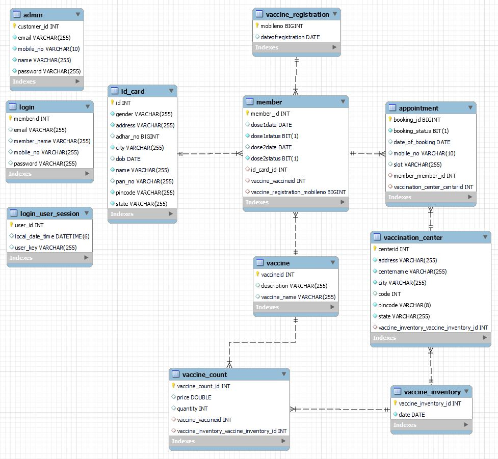

# Covid-19-Vaccination Application REST API

## Covid-19-Vaccination Application REST API
We collaboratively have developed REST API for Covid-19 Application. This API incorporates all the fundamental CRUD operations of both Admin side and Member/patient side along with validation for every entity and respective exception handling.

# Modules
- Login, Logout Module
- User Module
- Admin Module

# ER Diagram

# Features

* Admin Features:

Admin can add vaccination centers, Vaccine Details, and Vaccine Inventory

Admin have access to the details of different Member, Vaccine Center, Vaccine Inventory, user details, and Vaccine registration.

* User Features:

A user has login and logout.

A user can register himself or herself for vaccination and user register vaccines for family members.

Users can check near vaccination centers and vaccine availability with a slot.

After a member book appointment, they will get appointment details for the vaccine dose.

# Tech Stack used:
- Java
- Spring
- SpringBoot
- Spring Data JPA
- Hibernate
- MySQL Database
- Swagger UI
 
 Modules
 Login Module
 LogOut Module
 User Module
 Admin Module

# Contributors
- <a href="https://github.com/rajashekharms369">Rajashekhar Sambalad</a>
- <a href="https://github.com/sadanand012"> Sadanand Mare</a>
- <a href="https://github.com/GauravShirkeGS">Gaurav Shirke</a>
- <a href="https://github.comvikaspsr/">Vikas Kumar</a>

